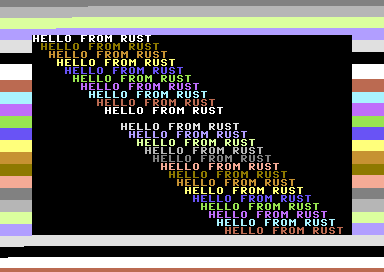

# rs-on-c64

An experiment of running Rust language code on the Commodore 64 using an alternate unofficial toolchain. There's a demo PRG executable in the src directory.

This project is not affiliated with or endorsed by the Rust Foundation or the Rust Project.

**Requires**:
* https://github.com/xTibor/mrustc
* https://github.com/xTibor/cc65

